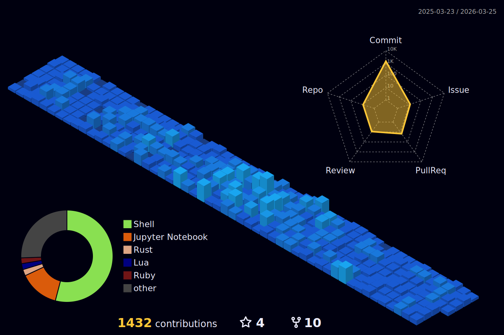

### Estudante do 7° período de Engenharia da Computação no CIN-UFPE

[](https://github.com/kittinan/spotify-github-profile)


[](https://skillicons.dev)

<!--START_SECTION:waka-->

```rust
From: 14 May 2024 - To: 09 February 2026

Total Time: 468 hrs 2 mins

Rust              121 hrs 40 mins >>>>>>-------------------   25.45 %
C                 85 hrs 3 mins   >>>>---------------------   17.79 %
Python            76 hrs 38 mins  >>>>---------------------   16.03 %
C++               35 hrs 45 mins  >>-----------------------   07.48 %
Go                33 hrs 38 mins  >>-----------------------   07.04 %
Bash              16 hrs 43 mins  >------------------------   03.50 %
Other             9 hrs 58 mins   >------------------------   02.09 %
```

<!--END_SECTION:waka-->


