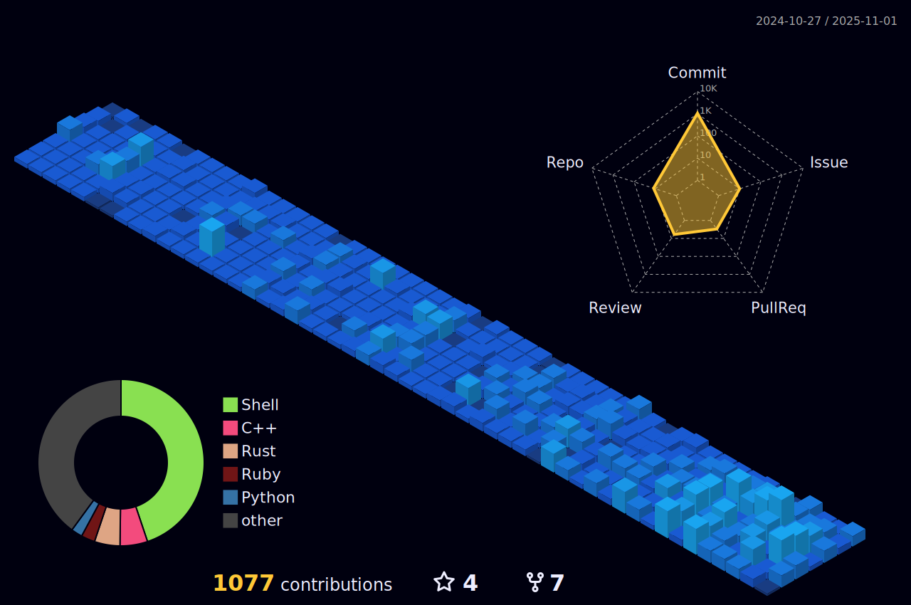

### Estudante do 4° período de Engenharia da Computação no CIN-UFPE

[](https://github.com/kittinan/spotify-github-profile)


[](https://skillicons.dev)

<!--START_SECTION:waka-->

```rust
From: 14 May 2024 - To: 08 April 2025

Total Time: 297 hrs 23 mins

Rust             95 hrs 22 mins  >>>>>>>>-----------------   31.37 %
C                36 hrs 59 mins  >>>----------------------   12.17 %
Go               33 hrs 15 mins  >>>----------------------   10.94 %
Python           29 hrs 47 mins  >>-----------------------   09.80 %
C++              29 hrs 39 mins  >>-----------------------   09.76 %
Bash             7 hrs 12 mins   >------------------------   02.37 %
Makefile         6 hrs 57 mins   >------------------------   02.29 %
Text             6 hrs 54 mins   >------------------------   02.27 %
Other            6 hrs 37 mins   >------------------------   02.18 %
```

<!--END_SECTION:waka-->


